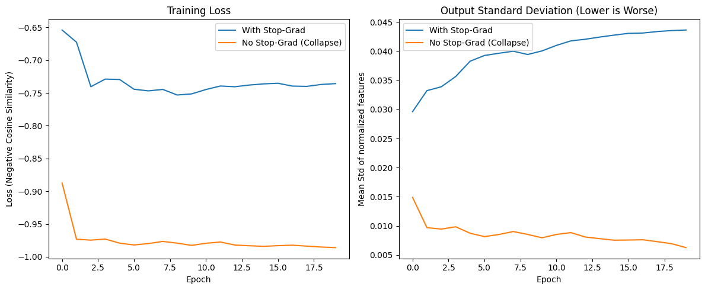

# SimSiam-Experiments-project-MEPhI
# SimSiam: Демонстрация проблемы коллапса в сиамских сетях

[](https://colab.research.google.com/drive/1criS6Ye5Mahy6mBCcTc2U_3u0qpLQSEE?usp=sharing)

В этом репозитории представлена минималистичная реализация архитектуры **SimSiam** на PyTorch, основанная на статье [*Exploring Simple Siamese Representation Learning*](https://arxiv.org/abs/2011.10566) (Xinlei Chen, Kaiming He, CVPR 2021).

Главная цель этого учебного проекта — наглядно показать, как одна простая операция `stop-gradient` (`.detach()` в PyTorch) предотвращает **коллапс представлений** (collapsing solutions) в задачах Self-Supervised Learning, когда сеть находит тривиальное решение и начинает выдавать один и тот же вектор для любых входных изображений.

Для быстрого воспроизведения эксперимента на обычных видеокартах (или в Colab) оригинальный пайплайн был адаптирован: используется датасет **CIFAR-10** (вместо ImageNet) и базовый энкодер **ResNet-18**.

## 📊 Результаты эксперимента (Абляция Stop-Gradient)

График ниже демонстрирует процесс обучения двух версий модели в течение 20 эпох:
1. **With Stop-Grad (Синяя линия)** — оригинальный подход авторов статьи.
2. **No Stop-Grad / Collapse (Оранжевая линия)** — симметричное обновление обеих веток сети (приводит к коллапсу).



### Анализ графиков:
* **Training Loss (Слева):** Без использования `stop-gradient` функция потерь мгновенно падает до идеального значения (косинусное сходство = -1.0). Сети кажется, что она идеально справляется с задачей.
* **Standard Deviation (Справа):** Это ключевая метрика проверки на коллапс. Она показывает среднее стандартное отклонение $\ell_2$-нормализованных векторов признаков. Если оно близко к нулю — сеть выдает константу. Как видно на графике, у сети *без* `stop-gradient` дисперсия коллапсирует практически в ноль, в то время как сеть *с* включенным `stop-gradient` формирует разнообразные и осмысленные признаки (std стабилизируется на уровне ~0.04).

## 🚀 Запуск кода

Самый простой и быстрый способ запустить и проверить код — использовать подготовленный ноутбук в Google Colab:

👉 **[Открыть проект в Google Colab](https://colab.research.google.com/drive/1criS6Ye5Mahy6mBCcTc2U_3u0qpLQSEE?usp=sharing)**

### Локальный запуск
Если вы хотите запустить скрипт на своем компьютере, убедитесь, что у вас установлены необходимые библиотеки:

```bash
git clone https://github.com/ТВОЙ_ЮЗЕРНЕЙМ/ТВОЙ_РЕПОЗИТОРИЙ.git
cd ТВОЙ_РЕПОЗИТОРИЙ
pip install torch torchvision matplotlib numpy

Затем просто запустите python скрипт:
code Bash

python simsiam_cifar10.py

Скрипт автоматически скачает датасет CIFAR-10, проведет обучение двух моделей и сохранит график simsiam_collapse_result.png в корневую папку.
🛠 Стек технологий

    Python

    PyTorch & Torchvision

    Matplotlib (для визуализации)
